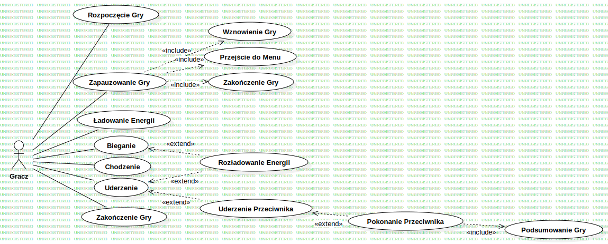

# Arena Fighter
## Autor Projektu - Mateusz Sas
## Data wykonania projektu - 28.05.2025r.
## Opis projektu
### Założenia
Aplikacja ma za zadanie realizację funkcjonalności pozwalających na:
* Start Rozgrywki
* Zastopowanie Rozgrywki
* Samą rozgrywkę, czyli funkcjonalność:
  * Poruszania się
  * Biegania
  * Ładowania Energii
  * Uderzania przeciwnika
* Wyświetlenie wyniku rozgrywki
### Cele projektowe
Celami projektu są:
* zbudowanie silnika do renderowania grafiki
* w oparciu o ww. silnik, zbudowanie gry
## Analiza systemowa
### Przypadki użycia
* #### Przypadek UC-1
  * Nazwa: Rozpoczęcie Gry
  * Opis: Rozpoczęcie Gry
  * Stan początkowy: Aplikacja wyświetla menu główne
  * Stan końcowy: Aplikacja uruchomiła grę
  * Aktorzy pierwszoplanowi: Gracze
  * Aktorzy drugoplanowi: -
  * Podstawowy przebieg zdarzeń:
    1. Przypadek użycia zaczyna się kiedy gracz chce rozpocząć grę
    2. Gracz wciska przycisk "Play"
    3. Gra się rozpoczyna
* #### Przypadek UC-2
  * Nazwa: Zakończenie Gry
  * Opis: Zakończenie Gry
  * Stan początkowy: Aplikacja wyświetla menu główne
  * Stan końcowy: Aplikacja zostaje zamknięta
  * Aktorzy pierwszoplanowi: Gracze
  * Aktorzy drugoplanowi: -
  * Podstawowy przebieg zdarzeń:
    1. Przypadek użycia zaczyna się kiedy gracz chce zakończyć grę
    2. Gracz wciska przycisk "Exit"
    3. Aplikacja wyłącza się
* #### Przypadek UC-3
  * Nazwa: Zapauzowanie gry
  * Opis: Zapauzowanie gry
  * Stan początkowy: Gra jest uruchomiona
  * Stan końcowy: Gra jest wstrzymana
  * Aktorzy pierwszoplanowi: Gracze
  * Aktorzy drugoplanowi: -
  * Podstawowy przebieg zdarzeń:
    1. Przypadek użycia zaczyna się gdy jeden z graczy chce zapauzować grę
    2. Gracz wciska przycisk pauzy
    3. Aplikacja wyświetla ekran pauzy
* #### Przypadek UC-4
  * Nazwa: Odpauzowanie gry
  * Opis: Odpauzowanie Gry
  * Stan początkowy: Gra jest wstrzymana
  * Stan końcowy: Gra jest uruchomiona
  * Aktorzy pierwszoplanowi: Gracze
  * Aktorzy drugoplanowi: -
  * Podstawowy przebieg zdarzeń:
    1. Przypadek użycia zaczyna się gdy gracz, który zapauzował grę chce ją odpauzować
    2. Gracz wciska przycisk "Resume"
    3. Aplikacja wznawia grę
* #### Przypadek UC-5
  * Nazwa: Przejście do Menu
  * Opis: Odpauzowanie Gry
  * Stan początkowy: Gra jest wstrzymana
  * Stan końcowy: Aplikacja wyświetla menu główne
  * Aktorzy pierwszoplanowi: Gracze
  * Aktorzy drugoplanowi: -
  * Podstawowy przebieg zdarzeń:
    1. Przypadek użycia zaczyna się gdy gracz, który zapauzował grę chce ją odpauzować
    2. Gracz wciska przycisk "Main Menu"
    3. Aplikacja przechodzi do menu głównego
* #### Przypadek UC-6
  * Nazwa: Wyjście z gry
  * Opis: Wyjście z gry
  * Stan początkowy: Gra jest wstrzymana
  * Stan końcowy: Aplikacja zostaje wyłączona
  * Aktorzy pierwszoplanowi: Gracze
  * Aktorzy drugoplanowi: -
  * Podstawowy przebieg zdarzeń:
    1. Przypadek użycia zaczyna się gdy gracz, który zapauzował grę chce ją zakończyć
    2. Gracz wciska przycisk "Exit"
    3. Aplikacja kończy swoje działanie
* #### Przypadek UC-7
  * Nazwa: Ładowanie Energii
  * Opis: Ładowanie Energii
  * Stan początkowy: Gra jest uruchomiona
  * Stan końcowy: Gra jest uruchomiona
  * Aktorzy pierwszoplanowi: Gracze
  * Aktorzy drugoplanowi: -
  * Podstawowy przebieg zdarzeń:
    1. Przypadek użycia zaczyna się gdy gracz chce podładować energię
    2. Gracz przytrzymuje odpowiedni przycisk
    3. Energia gracza się ładuje
* #### Przypadek UC-8
  * Nazwa: Chodzenie
  * Opis: Chodzenie
  * Stan początkowy: Gra jest uruchomiona
  * Stan końcowy: Gra jest uruchomiona
  * Aktorzy pierwszoplanowi: Gracze
  * Aktorzy drugoplanowi: -
  * Podstawowy przebieg zdarzeń:
    1. Przypadek użycia zaczyna się gdy gracz chce pochodzić
    2. Gracz przytrzymuje odpowiedni przycisk
    3. Gracz chodzi
* #### Przypadek UC-9
  * Nazwa: Bieganie
  * Opis: Bieganie
  * Stan początkowy: Gra jest uruchomiona
  * Stan końcowy: Gra jest uruchomiona
  * Aktorzy pierwszoplanowi: Gracze
  * Aktorzy drugoplanowi: -
  * Podstawowy przebieg zdarzeń:
    1. Przypadek użycia zaczyna się gdy gracz chce pobiegać
    2. Gracz mając wystarczającą ilość energii przytrzymuje odpowiednie przyciski
    3. Gracz biega
    4. Energia gracza zostaje zmniejszona
* #### Przypadek UC-10
  * Nazwa: Uderzenie
  * Opis: Uderzenie
  * Stan początkowy: Gra jest uruchomiona
  * Stan końcowy: Różne
  * Aktorzy pierwszoplanowi: Gracze
  * Aktorzy drugoplanowi: -
  * Podstawowy przebieg zdarzeń:
    1. Przypadek użycia zaczyna się gdy gracz chce uderzyć przeciwnika
    2. Gracz mając wystarczającą ilość energii przytrzymuje odpowiednie przyciski
    3. Gracz wykonuje uderzenie
    4. Gracz nie trafia
    5. Gra kontynuuje się
  * Alternatywny Przebieg A:
    4. Gracz trafia
    5. Życie przeciwnika zmniejsza się
    6. Przeciwnik zostaje oszołomiony
    7. Przeciwnik pozostaje przy życiu
    8. Gra kontynuuje się
  * Alternatywny Przebieg B:
    7. Przeciwnik zostaje pokonany
    8. Aplikacja pokazuje podsumowanie gry
### Diagram przypadków użycia

## Projekt architektury
### Wybór technologii informatycznych
* C - główny język używany w projekcie
* GLSL - język do pisania shaderów
* CMake - narzędzie do automatycznego zarządzania procesem kompilacji programu
* Vulkan - niskopoziomowe API graficzne zapewniające wydajny dostęp do GPU
* cglm - biblioteka do obliczeń z zakresu algebry liniowej
* cgltf - biblioteka do parsowania plików w formacie `gltf`
* freetype - biblioteka do parsowania plików w formacie `ttf`
* glfw - biblioteka do obsługi okienek i wejścia
* miniaudio - biblioteka do obsługi dźwięku
* openGJK - biblioteka implementująca algorytm GJK (Gilbert-Johnson-Keerthi), będący algorytmem detekcji przecięć
* stb_image.h - biblioteka wczytująca obrazki
* tinyobjloader - biblioteka do parsowania plików w formacie `obj`
### Diagram Klas

## Etapy wykonania projektu
1. 16.03.2025 - Stworzenie odpowiedniej abstrakcji dla potoku graficznego
2. 15.04.2025 - Implementacja renderowania czcionki
3. 19.04.2025 - Implementacja skybox
4. 29.04.2025 - Implementacja Animacji Szkieletowej
5. 30.04.2025 - Implementacja Menadżera Muzyki
6. 07.05.2025 - Stworzenie modelu wraz z animacjami
7. 10.05.2025 - Stworzenie abstrakcji warstw renderowanego obrazu
8. 14.05.2025 - Implementacja Wykrywania kolizji
9. 17.05.2025 - Stworzenie Podstawowego Interface'u
10. 21.05.2025 - Implementacja Mechanik Walki
11. 23.05.2025 - Małe poprawki
12. 25.05.2025 - Ulepszenie abstrakcji warstw renderowanego obrazu oraz naprawa błędów
